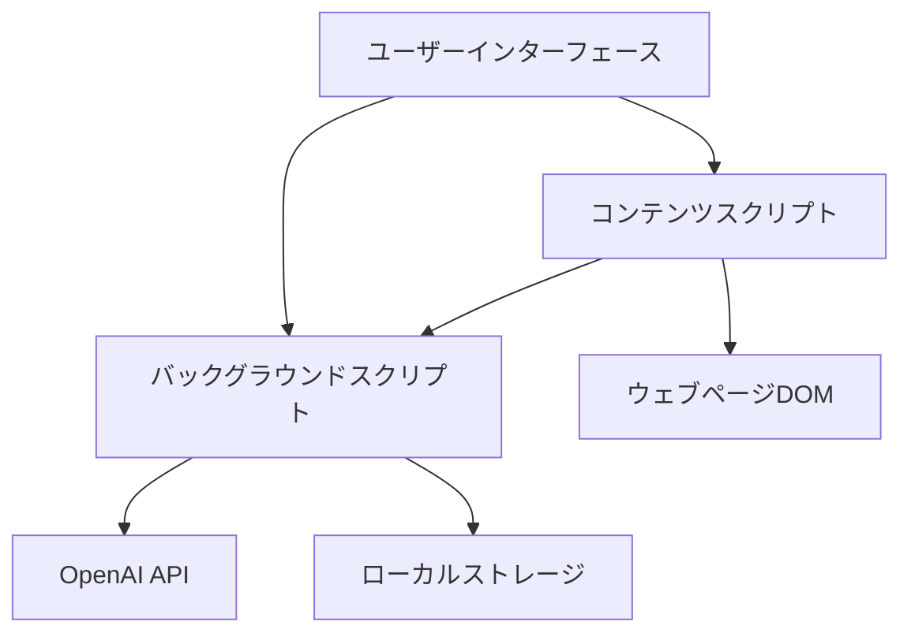
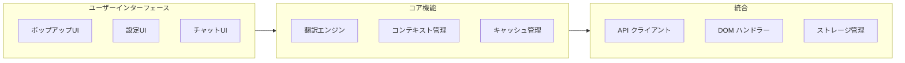
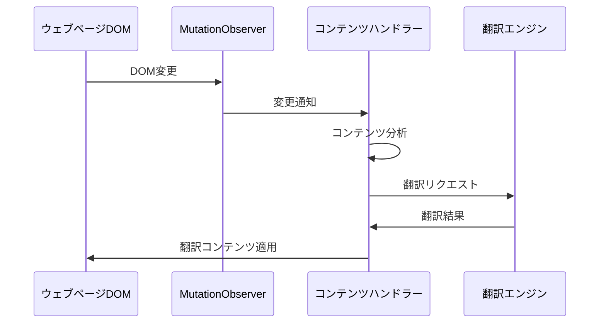
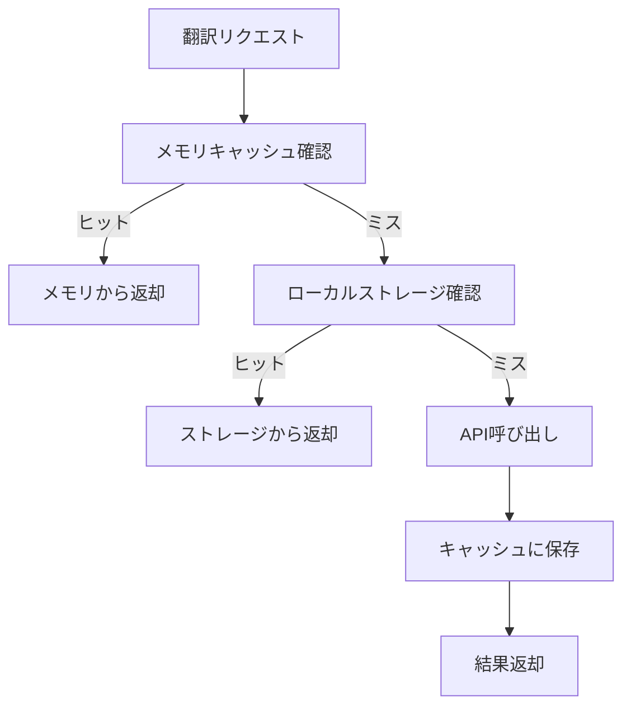
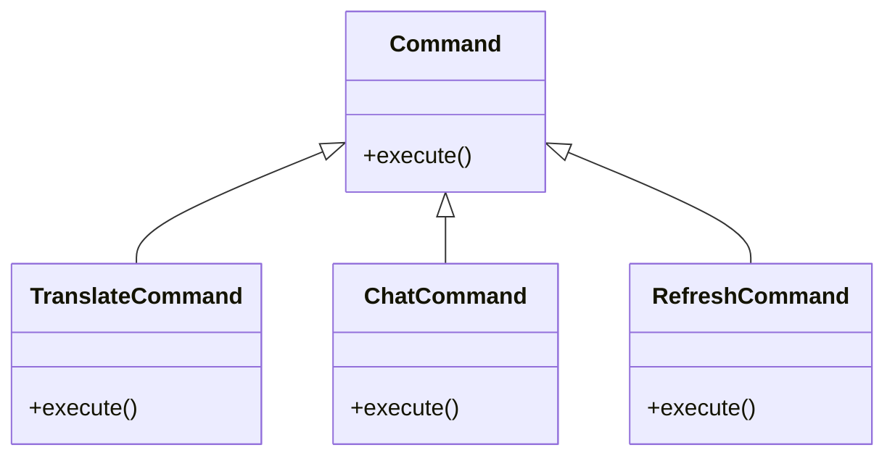
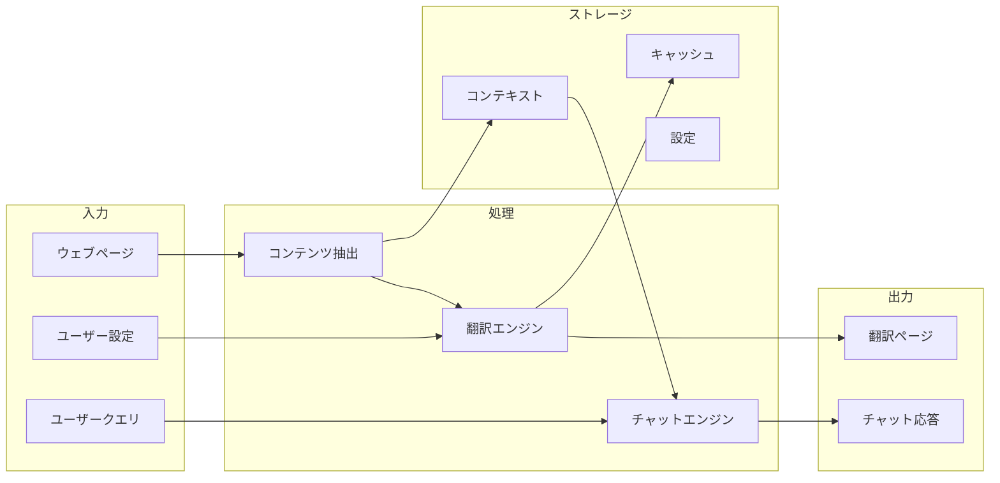

# システムパターン: Code Preserve Translator

## システムアーキテクチャ

Code Preserve Translatorは、Chrome拡張機能として実装され、以下の主要コンポーネントで構成されます：

### 主要コンポーネント

1. **ユーザーインターフェース (UI)**
   - 拡張機能のポップアップインターフェース
   - 設定画面
   - チャットインターフェース

2. **コンテンツスクリプト**
   - ウェブページのDOMと直接対話
   - テキストとコードブロックの識別
   - 翻訳されたコンテンツの表示

3. **バックグラウンドスクリプト**
   - OpenAI APIとの通信
   - キャッシュ管理
   - コンテキスト記憶の管理

4. **ストレージ**
   - 設定の保存
   - 翻訳キャッシュ
   - ページコンテキストの保存

## 設計パターン

### 1. モジュール化アーキテクチャ

拡張機能は明確に分離されたモジュールで構成され、各モジュールは特定の責任を持ちます：

### 2. オブザーバーパターン

DOM変更を監視し、新しいコンテンツが追加されたときに翻訳を適用します：

### 3. キャッシュ戦略

パフォーマンス最適化のための多層キャッシュ：

### 4. コマンドパターン

ユーザーアクションを抽象化し、一貫した方法で処理：

## コンポーネント間の関係

### データフロー

### 状態管理

拡張機能の状態は以下のように管理されます：

1. **アクティブページ状態**
   - 現在のページのコンテンツ
   - 翻訳状態
   - 抽出されたコードブロック

2. **グローバル状態**
   - ユーザー設定
   - API設定
   - 翻訳履歴

3. **セッション状態**
   - 現在のチャットコンテキスト
   - ページ間のコンテキスト連続性

## 技術的制約と対応策

1. **Chrome拡張機能の制限**
   - コンテンツスクリプトとバックグラウンドスクリプト間の通信は、メッセージパッシングを使用
   - ローカルストレージの容量制限に対応するため、効率的なデータ構造を使用

2. **API制限**
   - OpenAI APIの呼び出し制限に対応するためのキャッシュ戦略
   - エラー処理とリトライメカニズム

3. **パフォーマンス考慮事項**
   - 大きなページでのDOM操作の最適化
   - バックグラウンド処理の効率化
